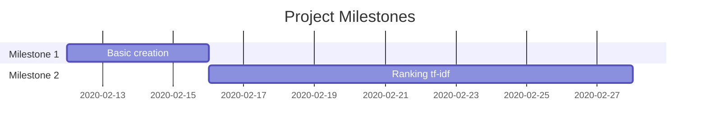

Search Engine
===
We are attempting to create a search engine that will go through a corpus of UC Irvine webpages.
> Move fast and break things [name=Mark Zuckerberg]

 
## Table of Contents

[TOC]

## Notes
* WARNING: Numbers such as "21576" or any other irrelevant sort is still accounted for. So webpages that have a lot of numbers (see 0/438) will be in our db; which is not good

## To-Do

**Bare-minimum** implementation

- [x] Tokenize words
- [x] Use lemmitization
- [ ] Inverted index
- [ ] Add to mongoDB
- [ ] User search ability

**Stretch Goals**
- [ ] Impement PageRank
- [ ] Implement GUI

Project Timeline
---

